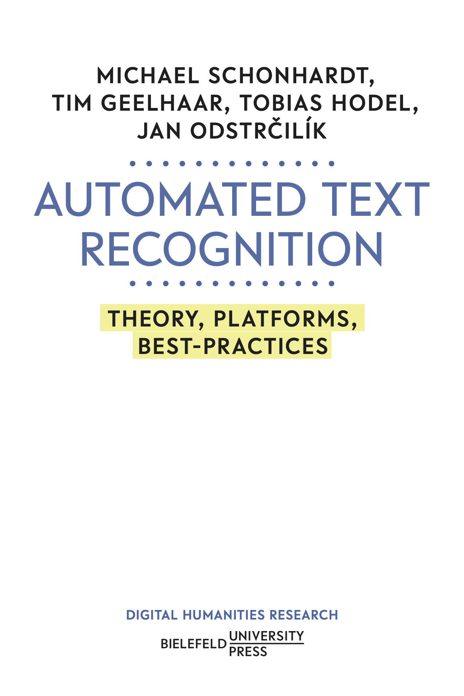

::: {.home-hero}
# Automated Text Recognition

A teaching resource on OCR and HTR for historical documents — from classical pipelines and open-source tools to modern transformer and vision-language models.

::: {.hero-actions}
[Start with the Introduction](content/introduction/index.qmd){.hero-cta .hero-cta-primary}
[Explore Models](content/models/open-source/index.qmd){.hero-cta .hero-cta-secondary}
[Take the Quiz](content/quiz/index.qmd){.hero-cta .hero-cta-secondary}
:::
:::

## What you will find here

::: {.section-cards}
<a href="content/introduction/index.qmd" class="section-card">
<h3>Introduction</h3>

What is OCR and HTR? The recognition pipeline, key metrics (CER/WER), and the challenges of historical documents.

</a>
<a href="content/escriptorium/index.qmd" class="section-card">
<h3>eScriptorium</h3>

The open-source annotation and transcription platform built on Kraken. Workflow, training, export, and further resources.

</a>
<a href="content/models/open-source/index.qmd" class="section-card">
<h3>Open-Source Models</h3>

A curated overview of publicly available Kraken/eScriptorium models for medieval and early modern manuscripts.

</a>
<a href="content/models/htr-united/index.qmd" class="section-card">
<h3>HTR-United</h3>

The community initiative for sharing HTR training data and models under standardized metadata.

</a>
<a href="content/modern-approaches/trocr/index.qmd" class="section-card">
<h3>TrOCR</h3>

Microsoft's transformer-based OCR model — architecture, pre-training, fine-tuning, and when to use it.

</a>
<a href="content/modern-approaches/vlms/index.qmd" class="section-card">
<h3>Vision Language Models</h3>

GPT-4o, Gemini, and open VLMs applied to historical text recognition — possibilities and limitations.

</a>
<a href="content/quiz/index.qmd" class="section-card">
<h3>Quiz</h3>

Test your knowledge with a Kahoot-style multiple-choice quiz covering all sections of this resource.

</a>
<a href="content/literature/index.qmd" class="section-card">
<h3>Literature</h3>

Key readings from the Zotero group <em>Automated Text Recognition</em>, searchable and organized by year.

</a>
<a href="content/workshops/index.qmd" class="section-card">
<h3>Workshops</h3>

Schedules and materials for hands-on ATR workshops. Next: DMSI 2026 Kalamazoo, 13 May 2026.

</a>
:::

---

## The Book

::: {.book-promo}
[{.book-cover}](https://doi.org/10.64136/nrlj5339)

::: {.book-info}
### Automated Text Recognition: Theory, Platforms, Best-Practices

**Michael Schonhardt, Tim Geelhaar, Tobias Hodel, Jan Odstrčilík**

*Digital Humanities Research.* Bielefeld University Press, 2026.
ISBN 978-3-69129-041-7 · [doi:10.64136/nrlj5339](https://doi.org/10.64136/nrlj5339)

The diverse landscape of platforms and recognition systems in the field of Automated Text Recognition (ATR) offers significant opportunities for the digital analysis and exploitation of handwritten sources. At the same time, in this complex and rapidly evolving field, established concepts of text processing and analysis quickly reach their limits.

This book provides scholars in the humanities with guidance by presenting technologies, platforms, key concepts, and case studies. It helps readers develop algorithmic literacy, enabling them to carry out both small- and large-scale projects using current technologies, as well as to engage with future developments in the field of ATR.

[Read open access →](https://doi.org/10.64136/nrlj5339){.hero-cta .hero-cta-primary}
:::
:::
